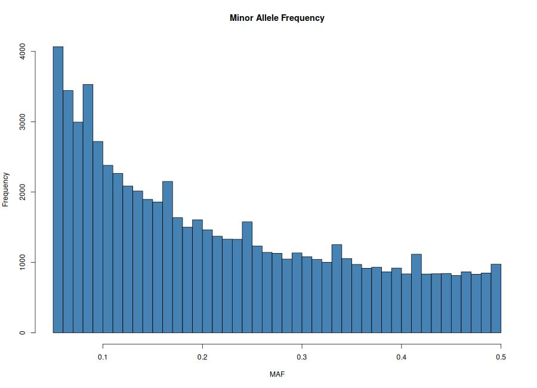
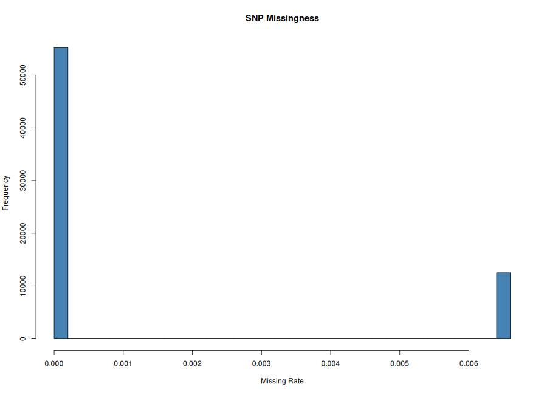
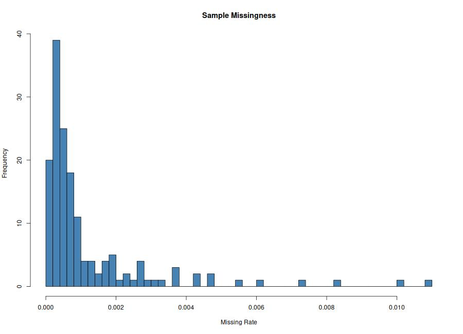

# Phase 1: Quality Control (QC) of Genomics Data

## Objective
The goal of this phase is to clean the raw genotype data (`Qatari156_filtered_pruned`) and characterize allele frequency and missingness before conducting any downstream predictive modeling or association studies.

**Initial Dataset Summary:**
* **Total Samples (Individuals):** 156 (49 males, 107 females)
* **Total Features (SNPs):** 67,735
* **Total Genotyping Rate:** 0.998816 (99.88% data completeness)

---

## Task 1: Compute Allele Frequencies
To understand the variance of our genetic features, we calculated the minor allele frequencies (MAF) for all SNPs.

### Commands Used:
```bash
# 1. Generate the frequencies using PLINK
plink1.9 --bfile ../data/Qatari156_filtered_pruned --freq --out outputs/SNPfreq

# 2. Extract min/max and generate distribution plot using R
Rscript MAF.R
```

### Results:
* **Minimum MAF:** 0.05118 (~5.1%)
* **Maximum MAF:** 0.5 (50%)
* *Interpretation:* The data has already been pre-filtered to remove ultra-rare variants. Every SNP in the dataset has a healthy variance (appearing between 5% and 50% of the time).

### MAF Distribution Histogram


---

## Task 2: Compute Genotype Missingness
To evaluate data quality, we calculated the amount of missing (null) data per SNP (locus) and per sample (individual).

### Commands Used:
```bash
# 1. Generate missingness reports using PLINK
plink1.9 --bfile ../data/Qatari156_filtered_pruned --missing --out outputs/miss

# 2. Generate missingness histograms using R
Rscript fMiss.R
```

### Results:
The overall dataset is extremely complete with a genotyping rate of **0.998816**. 
* `outputs/miss.imiss` contains the per-sample missingness data.
* `outputs/miss.lmiss` contains the per-SNP missingness data.

### Missingness Histograms



---

## Task 3: Apply Standard QC Filters & Threshold Testing
To ensure robust data for downstream modeling, we applied standard Quality Control filters. Because the baseline dataset was already highly clean, we also tested hyper-strict thresholds to observe data dropout rates.

### 1. Standard QC Baseline
This represents the industry standard for general predictive modeling.
* **Command:**
  ```bash
  plink1.9 --bfile ../data/Qatari156_filtered_pruned --maf 0.05 --geno 0.05 --hwe 1e-6 --make-bed --out outputs/dataQC
  ```
* **Result:** 0 variants removed. **67,735** variants remain.

### 2. Strict Missingness Test (Geno = 0.001)
This threshold demands 99.9% completeness for every single SNP, dropping any feature missing more than 0.1% of its data.
* **Command:**
  ```bash
  plink1.9 --bfile ../data/Qatari156_filtered_pruned --maf 0.05 --geno 0.001 --hwe 1e-6 --make-bed --out outputs/dataQC_strict_geno
  ```
* **Result:** 12,509 variants removed due to missingness. **55,226** variants remain.

### 3. Strict Minor Allele Frequency Test (MAF = 0.20)
This threshold restricts the dataset to only highly common genetic variations, dropping any SNP where the minor allele appears less than 20% of the time.
* **Command:**
  ```bash
  plink1.9 --bfile ../data/Qatari156_filtered_pruned --maf 0.20 --geno 0.05 --hwe 1e-6 --make-bed --out outputs/dataQC_strict_maf
  ```
* **Result:** 36,041 variants removed due to low frequency. **31,694** variants remain.

---

## Deliverable Summary: Threshold Justification Table

| Filter Strategy | MAF Threshold | Geno Threshold (Missingness) | HWE Threshold | Remaining SNPs | Justification / Why Used |
| :--- | :--- | :--- | :--- | :--- | :--- |
| **Standard Baseline** | > 0.05 | < 0.05 (95% Call Rate) | 10^-6 | **67,735** | Standard baseline for robust modeling. Removes rare variants and highly incomplete features without sacrificing too much genetic information. |
| **Strict Missingness** | > 0.05 | < 0.001 (99.9% Call Rate) | 10^-6 | **55,226** | Used to extract only the absolute highest-confidence features. Useful if imputation of missing data is not an option. |
| **Strict MAF** | > 0.20 | < 0.05 (95% Call Rate) | 10^-6 | **31,694** | Used to force the model to look exclusively at highly common genetic traits, effectively eliminating any risk of sequencing errors being treated as features. |

*Final output dataset selected for downstream analysis: `outputs/dataQC`*