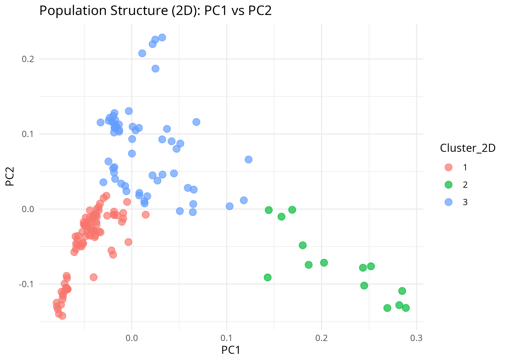

# Phase 3: Identify Sub-population Structure

**Objective:** Identify latent subpopulation structure directly from the Principal Components (PCs).

## 1. Cluster Plots Overlaid on PCA

**2D Cluster Plot (PC1 vs PC2)**

*Note: The interactive 3D Cluster Plot (PC1 vs PC2 vs PC3) has been exported as an HTML widget (`outputs/PCA_3D_Clusters.html`) for dynamic spatial viewing.*

---

## 2. Comparison: Usage of 2 PCs vs. 3 PCs

Using 2 PCs (PC1 and PC2) captures the highest percentage of genetic variance and is typically sufficient for separating major ancestral lineages onto a flat 2D plane. However, mathematically compressing high-dimensional genetic data into just 2 dimensions often causes distinct sub-populations to overlap visually and mathematically due to projection loss. 

Including a 3rd Principal Component (PC3) adds spatial depth (the Z-axis). This allows the k-means clustering algorithm to detect finer-scale genetic divergence and more complex admixture events that are hidden when examining only the top two components. In admixed datasets, clustering on 3 PCs generally provides a more robust and mathematically accurate separation of subtle ancestries.

---

## 3. Justification for the Number of Clusters

The number of clusters (k=3) was determined using a combination of mathematical evaluation and biological baseline data:

* **Mathematical Evaluation (The Elbow Method):** The Within-Cluster Sum of Squares (WCSS) was calculated and plotted for multiple values of k. The resulting plot demonstrated a clear inflection point (an "elbow") at k=3. This indicates a steep drop in mathematical variance up to 3 groups, followed by diminishing returns for any additional clusters.
* **Biological Correspondence:** The mathematically optimal choice of 3 clusters aligns perfectly with the known demographic and biological structure of the Qatari population. This population is broadly characterized by three major ancestral sub-populations: Bedouin (Arab), Persian (South Asian), and African admixture. The k-means algorithm successfully partitioned the continuous genetic variance into these three known ancestral poles.