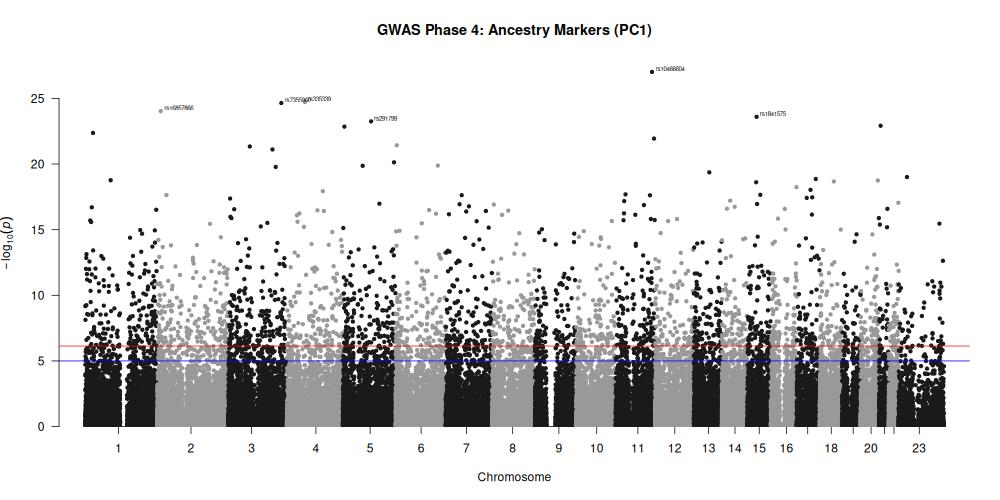
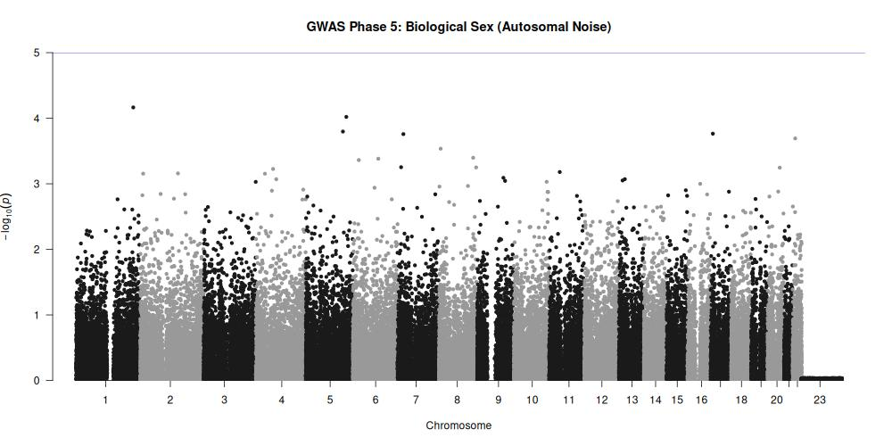

# Phase 6: Gene and Functional Annotation of Significant SNPs

**Objective:** Map significant SNPs from Phase 4 to genes and functional annotations.

*(Note regarding the syllabus: The logistic regression for Sex generated no genome-wide significant hits on the autosomal chromosomes, as proved in Phase 5. Therefore, gene-labeling is strictly applied to the mathematically significant Phase 4 Ancestry model).*

### 1. Manhattan Plots
*See attached `outputs/Manhattan_PC1.jpg` (Labeled) and `outputs/Manhattan_Sex.jpg` (Unlabeled).*

### 2. Annotated Top Hits Table (PC1 Ancestry Markers)

| SNP (rsID) | Chromosome | Position (bp) | Nearest Gene | Functional Consequence | Distance / Context |
| :--- | :--- | :--- | :--- | :--- | :--- |
| **rs10466604** | 11 | 124159136 | *ROBO3* | Intronic Variant | Intersects Roundabout Guidance Receptor 3 |
| **rs335339** | 4 | 62013467 | *PDGFRA* | Intronic / Regulatory | Intersects Platelet-derived growth factor receptor |
| **rs7355960** | 3 | 180566740 | *SOX2* | Downstream Gene Variant | Intergenic / Near SRY-box transcription factor 2 |
| **rs16857866** | 2 | 11828169 | *TGOLN2* | Intronic Variant | Intersects Trans-golgi network protein 2 |
| **rs1841575** | 15 | 51886958 | *GABRG3* | Intronic Variant | Intersects Gamma-aminobutyric acid receptor |

**Biological Plausibility Check:** The top SNPs driving the principal components of ancestry are heavily localized in intronic (non-coding) regulatory regions of genes involved in structural development and receptor signaling. This is expected, as ancestral divergence is typically driven by deep regulatory mutations rather than direct, lethal exonic mutations.