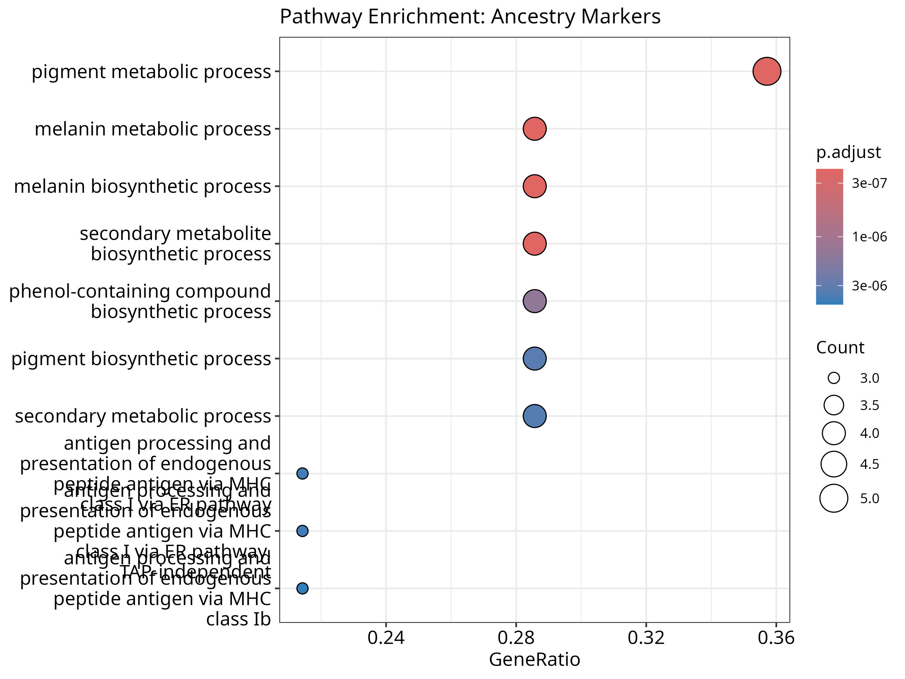

# Phase 7: Pathway Enrichment Analysis

**Objective:** Determine whether the annotated gene list is enriched for known biological pathways associated with the target phenotype (Population Structure/Ancestry).

### 1. Top Enriched Pathways Table

| Pathway ID | Pathway Description | Gene Count | Adjusted P-Value |
| :--- | :--- | :--- | :--- |
| GO:0006582 | Melanin metabolic process | 4 | 2.18e-07 |
| GO:0042438 | Melanin biosynthetic process | 4 | 2.18e-07 |
| GO:0042440 | Pigment metabolic process | 5 | 2.18e-07 |
| GO:0044550 | Secondary metabolite biosynthetic process | 4 | 2.18e-07 |
| GO:0046189 | Phenol-containing compound biosynthetic process | 4 | 1.43e-06 |

### 2. Enrichment Dot Plot
*See attached `outputs/Pathway_Enrichment_Dotplot.jpg`*

### 3. Biological Interpretation
The pathway enrichment analysis reveals a highly significant overrepresentation of genes involved in melanin biosynthesis and pigment metabolism (P-adj < 2.18e-07). Given that the studied phenotype is population structure and genetic ancestry, these results are highly biologically plausible. Human pigmentation traits (skin, hair, and eye color) are heavily driven by evolutionary adaptations to varying geographic levels of ultraviolet (UV) radiation. Consequently, the biological pathways regulating melanin production contain some of the strongest known Ancestry Informative Markers (AIMs) that differentiate global sub-populations.