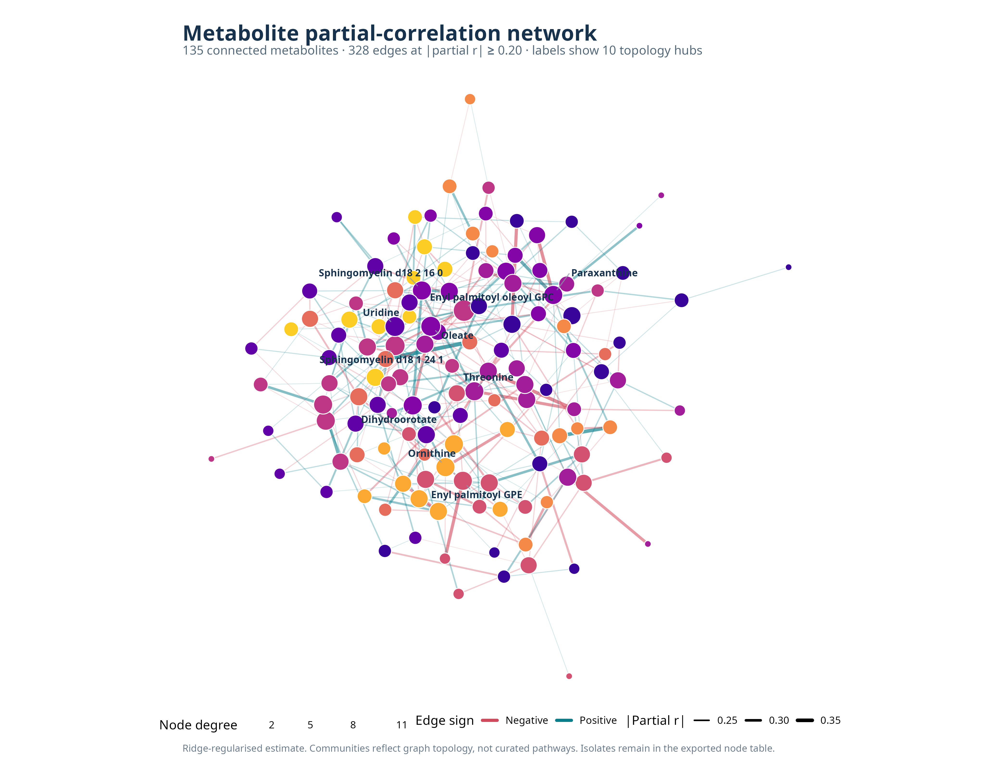
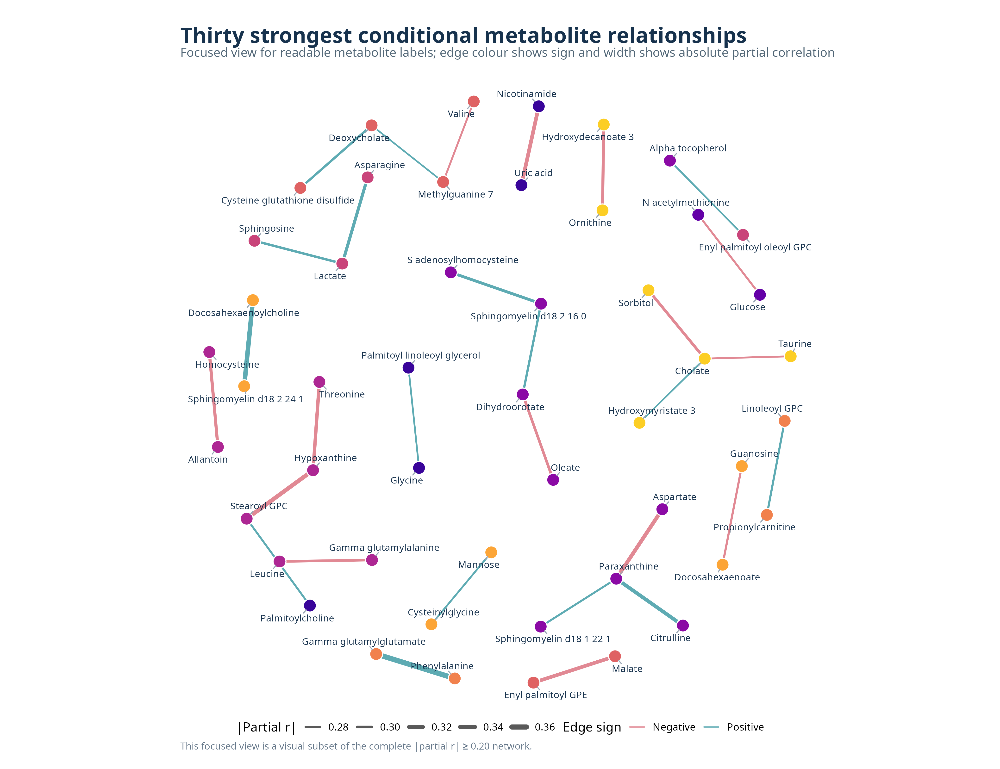

# Phase 14: Partial Correlation Network of Metabolites

## Objective

Estimate conditional relationships among metabolites after accounting for all other
measured metabolites, then export a readable network and Cytoscape-compatible tables.

## Method

The 136 QC-passed metabolites from 156 participants are standardized. Because the number
of variables is close to the sample size, the covariance matrix is ridge-regularized
before inversion. Partial correlations are obtained from the precision matrix and edges
are retained at `|partial r| >= 0.20`.

The calculation is appropriate for an exploratory network, but `0.20` is a heuristic
threshold rather than a formal significance or stability criterion. Threshold sensitivity
is therefore exported, and hub/pathway claims require bootstrap stability analysis or
external replication.

## Current result

The thresholded network contains 328 edges among 135 connected metabolites, with one
isolate. It has 183 positive and 145 negative edges and 11 topology-derived communities.
Node betweenness now treats inverse absolute partial correlation as edge distance; node
strength, degree, component, community, and isolate status are all exported.

The highest-degree hubs include Enyl palmitoyl oleoyl GPC, Oleate, Uridine,
Sphingomyelin d18 1 24 1, and Paraxanthine. Lipid-related hubs plus amino-acid and
nucleotide intermediates form a qualitatively plausible metabolic pattern, but community
colours represent graph topology rather than curated biochemical pathways.

## Figures

- `outputs/partial_correlation_network.png`: complete network with only the ten strongest
  hubs labelled; edge colour shows sign, edge width shows strength, node size shows degree,
  and node colour shows topology community.
- `outputs/partial_correlation_network_strongest_edges.png`: focused view of the 30
  strongest relationships with every endpoint labelled.

## Tables and Cytoscape files

- `outputs/ridge_partial_correlation_matrix.csv`: complete partial-correlation matrix.
- `outputs/cytoscape_edge_list.csv`: signed, weighted edge table.
- `outputs/cytoscape_node_table.csv`: node metrics and topology annotations.
- `outputs/metabolite_network.graphml`: complete network ready to import into Cytoscape.
- `outputs/network_hubs.csv`: top 20 nodes by degree, strength, and weighted betweenness.
- `outputs/network_threshold_sensitivity.csv`: network size at thresholds 0.15--0.30.
- `outputs/network_parameters.csv`: analysis configuration and graph summary.
- `outputs/network_interpretation.txt`: concise biological interpretation and limitations.

Cytoscape is not installed in this environment, so a true Cytoscape-exported image or
session file is not claimed. The GraphML and CSV files contain everything needed to apply
a Cytoscape force-directed layout and save a session/image later.
